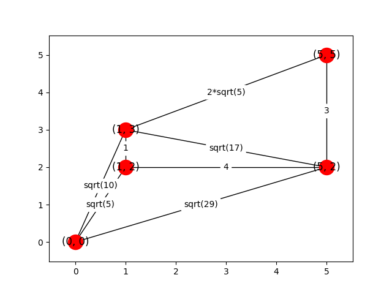

# Iceberg

Navigate a ship from point A to point B in the Northern Ocean with icebergs.
The path should be as short as possible and not cross any of the icebergs
(touching the iceberg is OK).

## Format

### Input
A file including
1. Integer with number of icebergs
2. A set of 2D polygons representing icebergs boundaries, represented as a set of ordered
coordinates. One line for an iceberg, the format: x1,y1 x2,y2 x3,y3.
3. Position of Start point A in the format x,y
4. Position of End point B in the format x,y

### Output
A file including
1. An ordered list of co­ordinates which combine the selected path from A to B not crossing
any iceberg. Including A and B.

## Solution

### Assumptions:
1. All polygons are convex.
2. The polygons are not overlapping with each other (touching is OK).

### Algorithm

Observation: the shortest route must only go through the start and end points
and vertices on the various icebergs. If an iceberg is blocking a possible
travel between two points, it is always shorter to go around it to its edge
rather than further.

Therefore, we first build an undirected graph where each point (start, end
and vertices of all the icebergs) is a node. Then, we go through each pair
of nodes and figure out if a route between them is possible (not blocked by
and iceberg). If the route is clear, we add an edge to the graph between
the two nodes and mark its weight as the geometric distance between them.

The graph might look something like this (for a starting point of ``(5, 0)``,
an end point of ``(5, 5)`` and a triangular iceberg in the middle):

Finally, we have a graph with all possible routes and their lengths. What is
left is to use a shortest route algorithm (such as Dijkstra's algorithm) to
calculate the shortest path.

